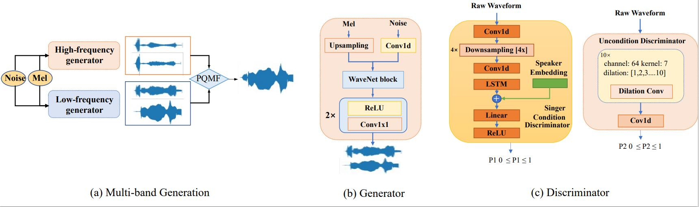

{:.no_toc}
* toc
{:toc}

# Abstract
{: width="70%"}{: .center}  

High-fidelity multi-singer singing voice synthesis is challenging for neural vocoder due to the singing voice data shortage, limited singer generalization, and large computational cost. Existing open corpora could not meet requirements for high-fidelity singing voice synthesis because of the scale and quality weaknesses. Previous vocoders have difficulty in multi-singer modeling, and a distinct degradation emerges when conducting unseen singer singing voice generation. To accelerate singing voice researches in the community, we release a large-scale, multi-singer Chinese singing voice dataset OpenSing. For tackling the difficulty in unseen singer modeling, we propose FMSing, a fast multi-singer vocoder with generative adversarial networks. Specifically, 1) FMSing uses a multi-band generator to speed up both training and inference procedure. 2) to capture and rebuild singer identity from the acoustic feature (i.e., mel-spectrogram), FMSing adopts a singer conditional discriminator and conditional adversarial training objective. 3) to supervise the reconstruction of singer identity in the spectrum envelopes in frequency domain, we propose an auxiliary singer perceptual loss. The joint training approach effectively works in GANs for multi-singer voices modeling. Experimental results verify the effectiveness of OpenSing and show that FMSing improves unseen singer singing voices modeling in both speed and quality over previous methods. The further experiment proves that combined with FastSpeech 2 as an acoustic model, FMSing achieves strong robustness in the multi-singer singing voice synthesis pipeline. Audio samples are available at <a href="https://FMSing.github.io/"><i>https://FMSing.github.io/</i></a>.

# OpenSing: Singing voice corpus

OpenSing contains pop songs collected from 93 singers, and singing utterances are saved in wav format, sampled at 24 kHz, and quantized by 16 bits. OpenSing consists of 50 hours of singing voices recorded in a professional recording studio, including 30 hours from 41 females and 20 hours from 25 males apart from the person-of-interest (POI). Figures in appendix A in the supplementary materials summarize the distribution of pitch, sentence-level duration, and phoneme-level duration of utterances. The major features of OpenSing include:
- Open source. Lack of data could obstruct the construction of SVS systems, so we release our corpus to accelerate research in the community.
- Large scale. Data-hungry singing voice systems need a significant amount of data in the training process. To our best knowledge, OpenSing is the most extensive Chinese multi-singer singing voice corpus.
- High quality. Similar to text-to-speech, high-quality audios without noise or background sound are essential for high-fidelity singing voice synthesis. Professional singers and studios both ensure high-quality utterances in OpenSing.

We have attached part of OpenSing to the supplementary materials, and we will release the entire dataset after paper publication.

<!-- |Pretrained Models|Config|
|--|--|
|[MelGAN](https://www.dropbox.com/s/nfwv48bnovidnod/de_logdir.zip?dl=0)| <a href="MelGAN.ymal">MelGAN.yaml </a>
|[Parallel WaveGAN](https://www.dropbox.com/s/nfwv48bnovidnod/de_logdir.zip?dl=0)| <a href="Parallel WaveGAN.ymal">Parallel WaveGAN.yaml </a>
|[WaveRNN](https://www.dropbox.com/s/nfwv48bnovidnod/de_logdir.zip?dl=0)| <a href="WaveRNN.ymal">WaveRNN.yaml </a> -->

# Multi-speaker modeling (Unseen Speakers)

<table>
    <thead>
    <th style="text-align: center">Utterance</th>
    <th style="text-align: center">Recording</th>
    <th style="text-align: center">WaveRNN</th>
    <th style="text-align: center">SC-WaveRNN</th>
    <th style="text-align: center">Parallel WaveGAN</th>
    <th style="text-align: center">MelGAN</th>
    <th style="text-align: center">FMSing</th>
    </thead>
    <tbody>
        <tr>
            <th>#1</th>
            <td style="text-align: center"><audio controls style="width: 150px;"><source src="wav_for_demo/singing/Test_unseen_woman/GT/1.wav" type="audio/wav"></audio></td>
            <td style="text-align: center"><audio controls style="width: 150px;"><source src="wav_for_demo/singing/Test_unseen_woman/WaveRNN/1.npy__750k_steps.wav" type="audio/wav"></audio></td>
            <td style="text-align: center"><audio controls style="width: 150px;"><source src="wav_for_demo/singing/Test_unseen_woman/SC_WaveRNN/1.wav" type="audio/wav"></audio></td>
            <td style="text-align: center"><audio controls style="width: 150px;"><source src="wav_for_demo/singing/Test_unseen_woman/Parallel_WaveGAN_50w/1_gen.wav" type="audio/wav"></audio></td>
            <td style="text-align: center"><audio controls style="width: 150px;"><source src="wav_for_demo/singing/Test_unseen_woman/MelGAN/1_gen.wav" type="audio/wav"></audio></td>
            <td style="text-align: center"><audio controls style="width: 150px;"><source src="wav_for_demo/singing/Test_unseen_woman/FMSing_total/1_gen.wav" type="audio/wav"></audio></td>
        </tr>
    </tbody>
    <tbody>
        <tr>
            <th>#2</th>
            <td style="text-align: center"><audio controls style="width: 150px;"><source src="wav_for_demo/singing/Test_unseen_woman/GT/10.wav" type="audio/wav"></audio></td>
            <td style="text-align: center"><audio controls style="width: 150px;"><source src="wav_for_demo/singing/Test_unseen_woman/WaveRNN/10.npy__750k_steps.wav" type="audio/wav"></audio></td>
            <td style="text-align: center"><audio controls style="width: 150px;"><source src="wav_for_demo/singing/Test_unseen_woman/SC_WaveRNN/10.wav" type="audio/wav"></audio></td>
            <td style="text-align: center"><audio controls style="width: 150px;"><source src="wav_for_demo/singing/Test_unseen_woman/Parallel_WaveGAN_50w/10_gen.wav" type="audio/wav"></audio></td>
            <td style="text-align: center"><audio controls style="width: 150px;"><source src="wav_for_demo/singing/Test_unseen_woman/MelGAN/10_gen.wav" type="audio/wav"></audio></td>
            <td style="text-align: center"><audio controls style="width: 150px;"><source src="wav_for_demo/singing/Test_unseen_woman/FMSing_total/10_gen.wav" type="audio/wav"></audio></td>
        </tr>
    </tbody>
    <tbody>
        <tr>
            <th>#3</th>
            <td style="text-align: center"><audio controls style="width: 150px;"><source src="wav_for_demo/singing/Test_unseen_woman/GT/4.wav" type="audio/wav"></audio></td>
            <td style="text-align: center"><audio controls style="width: 150px;"><source src="wav_for_demo/singing/Test_unseen_woman/WaveRNN/4.npy__750k_steps.wav" type="audio/wav"></audio></td>
            <td style="text-align: center"><audio controls style="width: 150px;"><source src="wav_for_demo/singing/Test_unseen_woman/SC_WaveRNN/4.wav" type="audio/wav"></audio></td>
            <td style="text-align: center"><audio controls style="width: 150px;"><source src="wav_for_demo/singing/Test_unseen_woman/Parallel_WaveGAN_50w/4_gen.wav" type="audio/wav"></audio></td>
            <td style="text-align: center"><audio controls style="width: 150px;"><source src="wav_for_demo/singing/Test_unseen_woman/MelGAN/4_gen.wav" type="audio/wav"></audio></td>
            <td style="text-align: center"><audio controls style="width: 150px;"><source src="wav_for_demo/singing/Test_unseen_woman/FMSing_total/4_gen.wav" type="audio/wav"></audio></td>
        </tr>
    </tbody>
        <tbody>
        <tr>
            <th>#4</th>
            <td style="text-align: center"><audio controls style="width: 150px;"><source src="wav_for_demo/singing/Test_unseen_man/GT/100627002.wav" type="audio/wav"></audio></td>
            <td style="text-align: center"><audio controls style="width: 150px;"><source src="wav_for_demo/singing/Test_unseen_man/WaveRNN/100627002.wav" type="audio/wav"></audio></td>
            <td style="text-align: center"><audio controls style="width: 150px;"><source src="wav_for_demo/singing/Test_unseen_man/SC_WaveRNN/100627002.npy__1100k_steps.wav" type="audio/wav"></audio></td>
            <td style="text-align: center"><audio controls style="width: 150px;"><source src="wav_for_demo/singing/Test_unseen_man/Parallel_WaveGAN_50w/100627002_gen.wav" type="audio/wav"></audio></td>
            <td style="text-align: center"><audio controls style="width: 150px;"><source src="wav_for_demo/singing/Test_unseen_man/MelGAN/100627002.wav" type="audio/wav"></audio></td>
            <td style="text-align: center"><audio controls style="width: 150px;"><source src="wav_for_demo/singing/Test_unseen_man/FMSing_total/100627002_gen.wav" type="audio/wav"></audio></td>
        </tr>
    </tbody>
    <tbody>
        <tr>
            <th>#5</th>
            <td style="text-align: center"><audio controls style="width: 150px;"><source src="wav_for_demo/singing/Test_unseen_man/GT/m2_2_stc4.wav" type="audio/wav"></audio></td>
            <td style="text-align: center"><audio controls style="width: 150px;"><source src="wav_for_demo/singing/Test_unseen_man/WaveRNN/m2_2_stc4.wav" type="audio/wav"></audio></td>
            <td style="text-align: center"><audio controls style="width: 150px;"><source src="wav_for_demo/singing/Test_unseen_man/SC_WaveRNN/m2_2_stc4.npy__1100k_steps.wav" type="audio/wav"></audio></td>
            <td style="text-align: center"><audio controls style="width: 150px;"><source src="wav_for_demo/singing/Test_unseen_man/Parallel_WaveGAN_50w/m2_2_stc4_gen.wav" type="audio/wav"></audio></td>
            <td style="text-align: center"><audio controls style="width: 150px;"><source src="wav_for_demo/singing/Test_unseen_man/MelGAN/m2_2_stc4.wav" type="audio/wav"></audio></td>
            <td style="text-align: center"><audio controls style="width: 150px;"><source src="wav_for_demo/singing/Test_unseen_man/FMSing_total/m2_2_stc4_gen.wav" type="audio/wav"></audio></td>
        </tr>
    </tbody>
    <tbody> 
        <tr>
            <th>#6</th>
            <td style="text-align: center"><audio controls style="width: 150px;"><source src="wav_for_demo/singing/Test_unseen_man/GT/m2_1_stc1.wav" type="audio/wav"></audio></td>
            <td style="text-align: center"><audio controls style="width: 150px;"><source src="wav_for_demo/singing/Test_unseen_man/WaveRNN/m2_1_stc1.wav" type="audio/wav"></audio></td>
            <td style="text-align: center"><audio controls style="width: 150px;"><source src="wav_for_demo/singing/Test_unseen_man/SC_WaveRNN/m2_1_stc1.npy__1100k_steps.wav" type="audio/wav"></audio></td>
            <td style="text-align: center"><audio controls style="width: 150px;"><source src="wav_for_demo/singing/Test_unseen_man/Parallel_WaveGAN_50w/m2_1_stc1_gen.wav" type="audio/wav"></audio></td>
            <td style="text-align: center"><audio controls style="width: 150px;"><source src="wav_for_demo/singing/Test_unseen_man/MelGAN/m2_1_stc1.wav" type="audio/wav"></audio></td>
            <td style="text-align: center"><audio controls style="width: 150px;"><source src="wav_for_demo/singing/Test_unseen_man/FMSing_total/m2_1_stc1_gen.wav" type="audio/wav"></audio></td>
        </tr>
    </tbody>
</table>

# Multi-speaker modeling (Seen Speakers)
<table>
    <thead>
    <th style="text-align: center">Utterance</th>
    <th style="text-align: center">Recording</th>
    <th style="text-align: center">WaveRNN</th>
    <th style="text-align: center">SC-WaveRNN</th>
    <th style="text-align: center">Parallel WaveGAN</th>
    <th style="text-align: center">MelGAN</th>
    <th style="text-align: center">FMSing</th>
    </thead>
    <tbody>
        <tr>
            <th>#1</th>
            <td style="text-align: center"><audio controls style="width: 150px;"><source src="wav_for_demo/singing/Test_seen_woman/GT/10.wav" type="audio/wav"></audio></td>
            <td style="text-align: center"><audio controls style="width: 150px;"><source src="wav_for_demo/singing/Test_seen_woman/WaveRNN/10.wav" type="audio/wav"></audio></td>
            <td style="text-align: center"><audio controls style="width: 150px;"><source src="wav_for_demo/singing/Test_seen_woman/SC_WaveRNN/10.wav" type="audio/wav"></audio></td>
            <td style="text-align: center"><audio controls style="width: 150px;"><source src="wav_for_demo/singing/Test_seen_woman/ParallWaveGAN/10.wav" type="audio/wav"></audio></td>
            <td style="text-align: center"><audio controls style="width: 150px;"><source src="wav_for_demo/singing/Test_seen_woman/MelGAN/10.wav" type="audio/wav"></audio></td>
            <<td style="text-align: center"><audio controls style="width: 150px;"><source src="wav_for_demo/singing/Test_seen_woman/FMSing_total/10.wav" type="audio/wav"></audio></td>
        </tr>
    </tbody>
    <tbody>
        <tr>
            <th>#2</th>
            <td style="text-align: center"><audio controls style="width: 150px;"><source src="wav_for_demo/singing/Test_seen_woman/GT/11.wav" type="audio/wav"></audio></td>
            <td style="text-align: center"><audio controls style="width: 150px;"><source src="wav_for_demo/singing/Test_seen_woman/WaveRNN/11.wav" type="audio/wav"></audio></td>
            <td style="text-align: center"><audio controls style="width: 150px;"><source src="wav_for_demo/singing/Test_seen_woman/SC_WaveRNN/11.wav" type="audio/wav"></audio></td>
            <td style="text-align: center"><audio controls style="width: 150px;"><source src="wav_for_demo/singing/Test_seen_woman/ParallWaveGAN/11.wav" type="audio/wav"></audio></td>
            <td style="text-align: center"><audio controls style="width: 150px;"><source src="wav_for_demo/singing/Test_seen_woman/MelGAN/11.wav" type="audio/wav"></audio></td>
            <<td style="text-align: center"><audio controls style="width: 150px;"><source src="wav_for_demo/singing/Test_seen_woman/FMSing_total/11.wav" type="audio/wav"></audio></td>
        </tr>
    </tbody>
    <tbody>
        <tr>
            <th>#3</th>
            <td style="text-align: center"><audio controls style="width: 150px;"><source src="wav_for_demo/singing/Test_seen_woman/GT/15.wav" type="audio/wav"></audio></td>
            <td style="text-align: center"><audio controls style="width: 150px;"><source src="wav_for_demo/singing/Test_seen_woman/WaveRNN/15.wav" type="audio/wav"></audio></td>
            <td style="text-align: center"><audio controls style="width: 150px;"><source src="wav_for_demo/singing/Test_seen_woman/SC_WaveRNN/15.wav" type="audio/wav"></audio></td>
            <td style="text-align: center"><audio controls style="width: 150px;"><source src="wav_for_demo/singing/Test_seen_woman/ParallWaveGAN/15.wav" type="audio/wav"></audio></td>
            <td style="text-align: center"><audio controls style="width: 150px;"><source src="wav_for_demo/singing/Test_seen_woman/MelGAN/15.wav" type="audio/wav"></audio></td>
            <<td style="text-align: center"><audio controls style="width: 150px;"><source src="wav_for_demo/singing/Test_seen_woman/FMSing_total/15.wav" type="audio/wav"></audio></td>
        </tr>
    </tbody>
        <tbody>
        <tr>
            <th>#4</th>
            <td style="text-align: center"><audio controls style="width: 150px;"><source src="wav_for_demo/singing/Test_seen_man/GT/10.wav" type="audio/wav"></audio></td>
            <td style="text-align: center"><audio controls style="width: 150px;"><source src="wav_for_demo/singing/Test_seen_man/WaveRNN/10.wav" type="audio/wav"></audio></td>
            <td style="text-align: center"><audio controls style="width: 150px;"><source src="wav_for_demo/singing/Test_seen_man/SC_WaveRNN/10.wav" type="audio/wav"></audio></td>
            <td style="text-align: center"><audio controls style="width: 150px;"><source src="wav_for_demo/singing/Test_seen_man/PWG/10.wav" type="audio/wav"></audio></td>
            <td style="text-align: center"><audio controls style="width: 150px;"><source src="wav_for_demo/singing/Test_seen_man/MelGAN/10.wav" type="audio/wav"></audio></td>
            <td style="text-align: center"><audio controls style="width: 150px;"><source src="wav_for_demo/singing/Test_seen_man/FMSing_total/10.wav" type="audio/wav"></audio></td>
        </tr>
    </tbody>
    <tbody>
        <tr>
            <th>#5</th>
            <td style="text-align: center"><audio controls style="width: 150px;"><source src="wav_for_demo/singing/Test_seen_man/GT/11.wav" type="audio/wav"></audio></td>
            <td style="text-align: center"><audio controls style="width: 150px;"><source src="wav_for_demo/singing/Test_seen_man/WaveRNN/11.wav" type="audio/wav"></audio></td>
            <td style="text-align: center"><audio controls style="width: 150px;"><source src="wav_for_demo/singing/Test_seen_man/SC_WaveRNN/11.wav" type="audio/wav"></audio></td>
            <td style="text-align: center"><audio controls style="width: 150px;"><source src="wav_for_demo/singing/Test_seen_man/PWG/11.wav" type="audio/wav"></audio></td>
            <td style="text-align: center"><audio controls style="width: 150px;"><source src="wav_for_demo/singing/Test_seen_man/MelGAN/11.wav" type="audio/wav"></audio></td>
            <td style="text-align: center"><audio controls style="width: 150px;"><source src="wav_for_demo/singing/Test_seen_man/FMSing_total/11.wav" type="audio/wav"></audio></td>
        </tr>
    </tbody>
    <tbody>
        <tr>
            <th>#6</th>
            <td style="text-align: center"><audio controls style="width: 150px;"><source src="wav_for_demo/singing/Test_seen_man/GT/12.wav" type="audio/wav"></audio></td>
            <td style="text-align: center"><audio controls style="width: 150px;"><source src="wav_for_demo/singing/Test_seen_man/WaveRNN/12.wav" type="audio/wav"></audio></td>
            <td style="text-align: center"><audio controls style="width: 150px;"><source src="wav_for_demo/singing/Test_seen_man/SC_WaveRNN/12.wav" type="audio/wav"></audio></td>
            <td style="text-align: center"><audio controls style="width: 150px;"><source src="wav_for_demo/singing/Test_seen_man/PWG/12.wav" type="audio/wav"></audio></td>
            <td style="text-align: center"><audio controls style="width: 150px;"><source src="wav_for_demo/singing/Test_seen_man/MelGAN/12.wav" type="audio/wav"></audio></td>
            <td style="text-align: center"><audio controls style="width: 150px;"><source src="wav_for_demo/singing/Test_seen_man/FMSing_total/12.wav" type="audio/wav"></audio></td>
        </tr>
    </tbody>
</table>

# Singing Voice Synthesis

<ruby>带  我  飞  飞  过  绝  望<rt style="font-size: 15px;">dai wo fei fei guo jue wang </rt>
</ruby>
<table>
	<thead>
		<tr>
			<th style="text-align: center">Recording</th>
			<th style="text-align: center">FastSpeech2+FMSing</th>
		</tr>
	</thead>
	<tbody>
		<tr>
			<td style="text-align: center"><audio controls style="width: 150px;"><source src="wav_for_demo/system/GT/[G]带我飞飞过绝望_gen.wav" type="audio/wav"></audio></td>
			<td style="text-align: center"><audio controls style="width: 150px;"><source src="wav_for_demo/system/FMSing/带我飞飞过绝望.wav"  type="audio/wav"></audio></td>
		</tr>
	</tbody>
</table>

<ruby>就  飞  多  远  吧<rt style="font-size: 15px;">jiu fei duo yuan ba </rt>
</ruby>
<table>
	<thead>
		<tr>
			<th style="text-align: center">Recording</th>
			<th style="text-align: center">FastSpeech2+FMSing</th>
		</tr>
	</thead>
	<tbody>
		<tr>
			<td style="text-align: center"><audio controls style="width: 150px;"><source src="wav_for_demo/system/GT/[G]就飞多远吧_gen.wav" type="audio/wav"></audio></td>
			<td style="text-align: center"><audio controls style="width: 150px;"><source src="wav_for_demo/system/FMSing/就飞多远吧.wav"  type="audio/wav"></audio></td>
		</tr>
	</tbody>
</table>

<ruby>就  算  很  受  伤  也  不  闪  泪  光<rt style="font-size: 15px;">jiu suan hen shou shang ye bu shan lei guang </rt>
</ruby>
<table>
	<thead>
		<tr>
			<th style="text-align: center">Recording</th>
			<th style="text-align: center">FastSpeech2+FMSing</th>
		</tr>
	</thead>
	<tbody>
		<tr>
			<td style="text-align: center"><audio controls style="width: 150px;"><source src="wav_for_demo/system/GT/[G]就算很受伤也不闪泪光_gen.wav" type="audio/wav"></audio></td>
			<td style="text-align: center"><audio controls style="width: 150px;"><source src="wav_for_demo/system/FMSing/就算很受伤也不闪泪光.wav"  type="audio/wav"></audio></td>
		</tr>
	</tbody>
</table>

<ruby>我  松  开  时  间  的  绳  索<rt style="font-size: 15px;">wo song kai shi jian de sheng suo </rt>
</ruby>
<table>
	<thead>
		<tr>
			<th style="text-align: center">Recording</th>
			<th style="text-align: center">FastSpeech2+FMSing</th>
		</tr>
	</thead>
	<tbody>
		<tr>
			<td style="text-align: center"><audio controls style="width: 150px;"><source src="wav_for_demo/system/GT/[G]我松开时间的绳索_gen.wav" type="audio/wav"></audio></td>
			<td style="text-align: center"><audio controls style="width: 150px;"><source src="wav_for_demo/system/FMSing/我松开时间的绳索.wav"  type="audio/wav"></audio></td>
		</tr>
	</tbody>
</table>

<ruby>原  来  你  生  来  就  属  于  天  际<rt style="font-size: 15px;">yuan lai ni sheng lai jiu shu yu tian ji </rt>
</ruby>
<table>
	<thead>
		<tr>
			<th style="text-align: center">Recording</th>
			<th style="text-align: center">FastSpeech2+FMSing</th>
		</tr>
	</thead>
	<tbody>
		<tr>
			<td style="text-align: center"><audio controls style="width: 150px;"><source src="wav_for_demo/system/GT/[G]原来你生来就属于天际_gen.wav" type="audio/wav"></audio></td>
			<td style="text-align: center"><audio controls style="width: 150px;"><source src="wav_for_demo/system/FMSing/原来你生来就属于天际.wav"  type="audio/wav"></audio></td>
		</tr>
	</tbody>
</table>

<ruby>庄  稼  早  已  收  割  完<rt style="font-size: 15px;">zhuang jia zao yi shou ge wan </rt>
</ruby>
<table>
	<thead>
		<tr>
			<th style="text-align: center">Recording</th>
			<th style="text-align: center">FastSpeech2+FMSing</th>
		</tr>
	</thead>
	<tbody>
		<tr>
			<td style="text-align: center"><audio controls style="width: 150px;"><source src="wav_for_demo/system/GT/[G]庄稼早已收割完_gen.wav" type="audio/wav"></audio></td>
			<td style="text-align: center"><audio controls style="width: 150px;"><source src="wav_for_demo/system/FMSing/庄稼早已收割完.wav"  type="audio/wav"></audio></td>
		</tr>
	</tbody>
</table>
